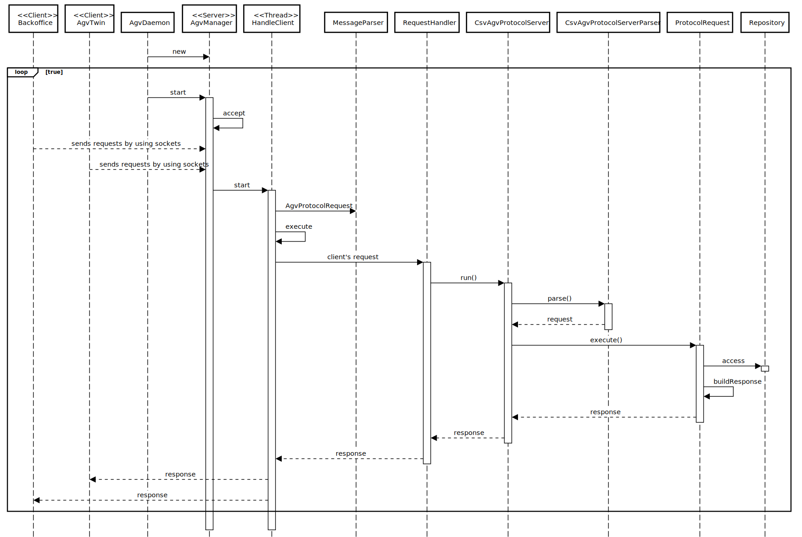

# US4001
=======================================

# 1. Requisitos

*As Project Manager, I want that the "AGVManager" component supports properly, at request, the needs of the "BackOfficeApp" application as well as the needs the AGV digital twin.*

# 2. Análise

*Specifications:*

*As Project Manager, I want that the "AGVManager" component supports properly, at request, the needs of the "BackOfficeApp" application as well as the needs the AGV digital twin.*

# 3. Design

## 3.1. Realização da Funcionalidade

## 3.2. Padrões Aplicados

*Nesta secção deve apresentar e explicar quais e como foram os padrões de design aplicados e as melhores práticas.*

## 3.4. Testes
*Nesta secção deve sistematizar como os testes foram concebidos para permitir uma correta aferição da satisfação dos requisitos.*

**No Tests were implemented**

# 4. Implementação

##CsvAgvProtocolProxy
     public class CsvAgvProtocolProxy {

    private static final Logger LOGGER = LogManager.getLogger(CsvAgvProtocolProxy.class);

    /**
     * @author Paulo Gandra de Sousa 2021.05.25
     */
    public static class ClientSocket {

        private Socket sock;
        private PrintWriter output;
        private BufferedReader input;

        /**
         * @param address
         * @param port
         *
         * @throws IOException
         */
        public void connect(final String address, final int port) throws IOException {
            InetAddress serverIP;

            serverIP = InetAddress.getByName(address);

            sock = new Socket(serverIP, port);
            output = new PrintWriter(sock.getOutputStream(), true);
            input = new BufferedReader(new InputStreamReader(sock.getInputStream()));
            LOGGER.debug("Connected to {}", address);
        }

        /**
         * @param request
         */
        public void send(final String request) {
            output.println(request);
            LOGGER.debug("Sent message\n-----\n{}\n-----", request);
        }

        public List<String> recv() throws IOException {
            final var resp = new ArrayList<String>();

            var eof = false;
            do {
                final String inputLine = input.readLine();
                if (inputLine != null) {
                    if (inputLine.equals("")) {
                        eof = true;
                    } else {
                        resp.add(inputLine);
                    }
                }
            } while (!eof);

            LOGGER.debug("Received message:\n----\n{}\n----", resp);

            return resp;
        }

        /**
         * @param request
         *
         * @return
         *
         * @throws IOException
         */
        public List<String> sendAndRecv(final String request) throws IOException {
            send(request);
            return recv();
        }

        /**
         * @throws IOException
         */
        public void stop() throws IOException {
            input.close();
            output.close();
            sock.close();
        }
    }

    /**
     * @param id
     *
     * @return
     *
     * @throws IOException
     */
    public String getAgvId(final String id)
            throws IOException, FailedRequestException {
        final var socket = new ClientSocket();
        socket.connect(getAddress(), getPort());

        final String request = getAgvIdBuild(id);
        final List<String> response = socket.sendAndRecv(request);

        socket.stop();

        return (response.toString());
    }

    public String getAgvId2(final String id)
            throws IOException, FailedRequestException {
        final var socket = new ClientSocket();
        socket.connect(getAddress(), getPort());

        final String request = getAgvIdBuild2(id);
        final List<String> response = socket.sendAndRecv(request);

        socket.stop();

        return (response.toString());
    }

    public String getAgvId3(final String id)
            throws IOException, FailedRequestException {
        final var socket = new ClientSocket();
        socket.connect(getAddress(), 8012);

        final String request = getAgvIdBuild(id);
        final List<String> response = socket.sendAndRecv(request);

        socket.stop();

        return (response.toString());
    }

    public String getAgvIdBuild(String id){
        return "ALL_AGVS, \"" +  id + "\"";
    }

    public String getAgvIdBuild2(String id){
        return "ALL_AGVS1, \"" +  id + "\"";
    }

    private int getPort() {
        // TODO read from config file
        return 8011;
    }

    private String getAddress() {
        // TODO read from config file
        String name="rcomp";

     try {
     name= InetAddress.getLocalHost().getHostAddress();
     } catch (UnknownHostException e) {
      e.printStackTrace();
      }

        //name = ip do agv manager*/

        return name;
    }

    private String removeDoubleQuotes(final String token) {
        return token.replace("\"", "").trim();
    }

    private void checkForErrorMessage(final List<String> response) throws FailedRequestException {
        final String[] tokens = response.get(0).split(",");
        final String messageType = tokens[0];

        if (messageType.equals("SERVER_ERROR")
                || messageType.equals("BAD_REQUEST")
                || messageType.equals("UNKNOWN_REQUEST")
                || messageType.equals("ERROR_IN_REQUEST")) {
            throw new FailedRequestException();
        }
    }

*Recomenda-se que organize este conteúdo por subsecções.*

# 5. Integração/Demonstração

*Tivémos o cuidado de assegurar que todas as funcionalidades se complementam pois algumas delas dependem das outras.
Neste sprint quase todas as funcionalidades são desempenhadas por um sales clerk desta maneira elas estão interligadas.*

# 6. Observações

*A implementação por nós pensada e realizada parece assentar naquilo que seria o mais funcioonal para a funcionalidade
pedida.*

