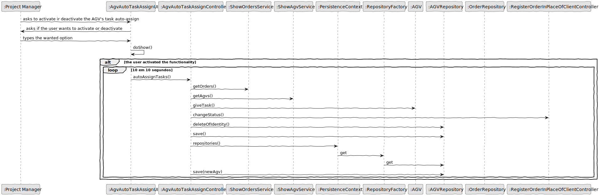

# US1005
=======================================

# 1. Requisitos

*As Project Manager, I want that the "AGVManager" component is enhanced with a basic FIFO algorithm to automatically assign tasks to AGVs.*

# 2. Análise

*Specifications:*

*A  category consists only of an alphanumeric code, and a description. Each product belongs mandatorily to a single category.*

# 3. Design

## 3.1. Realização da Funcionalidade

## 3.2. Padrões Aplicados

*Nesta secção deve apresentar e explicar quais e como foram os padrões de design aplicados e as melhores práticas.*

## 3.4. Testes
*Nesta secção deve sistematizar como os testes foram concebidos para permitir uma correta aferição da satisfação dos requisitos.*

**Teste 1:** Verificar que não é possível criar uma instância da classe Exemplo com valores nulos.

	

# 4. Implementação
##CategoryController
    

*Recomenda-se que organize este conteúdo por subsecções.*

# 5. Integração/Demonstração

*Nesta secção a equipa deve descrever os esforços realizados no sentido de integrar a funcionalidade desenvolvida com as restantes funcionalidades do sistema.*

# 6. Observações

*A implementação por nós pensada e realizada parece assentar naquilo que seria o mais eficientee para a funcionalidade pedida.*

