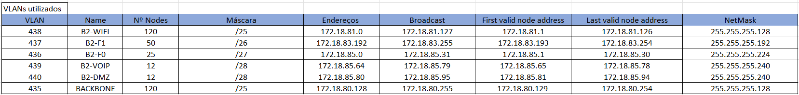
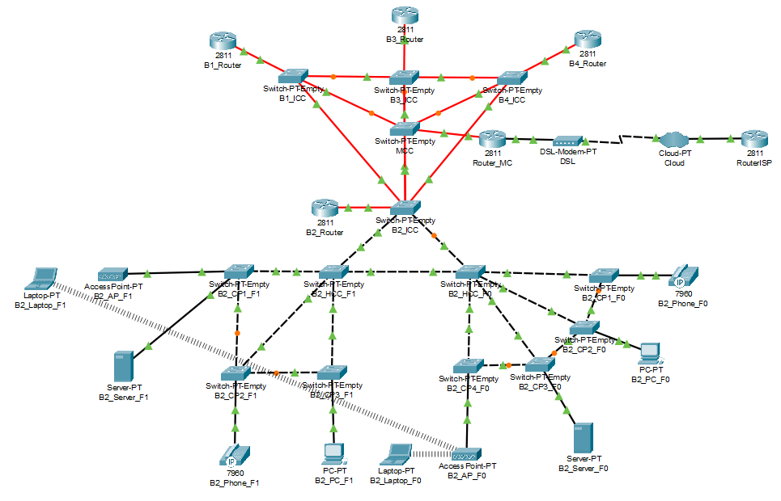

RCOMP 2021-2022 Project - Sprint 2 - Member 1201484 folder
===========================================
# Edifício 2

**Planeamento**
-------------------
> No inicio do projeto dividimos os endereços de rede pelos vários espaços e serviços. Esta divisão encontra-se devidamnete justificada no planning.md. No cálculo da subnetting atribuimos as mascáras para cada end device dependendo do seu número de nodes, após isso ordenámos por ordem descrescente e somámos o respetivo tamanho de blocos a cada endereço, após isso calculámos o broadcast, o primeiro e último valores de endereço válidos. Para além dos endereços, atribuímos também as VLANs a cada end device tendo em consideração o intervalo atribuído ao nosso grupo. Para o edifício 2 os endereços de rede atribuidos e VLANs encontram-se na seguinte tabela:
> 

> 
> Apesar de apenas serem estas VLANs do edifício, estão representadas na simulação todas as VLANs do campus, nos switches.
> 
**Projeto no Packet Tracer**
--------------------------
>Depois de todos os cálculos feitos em relação aos endereços e às VLANs, iniciámos a simulação no packet tracer. Para o edifício 2 a rede definida foi a seguinte:
>

>
**Explicação do projeto implementado**

>**Backbone**
> 
> O backbone do campus está representado através do Switch_MCC que corresponde ao main cross connect, dos Switches B1_ICC, B3_ICC, B4_ICC e os seus routers que correspondem aos restantes edifícios do campus, e também  pelo router do edifício 2.
> Tal como no Sprint 1, as ligações de dados pelos edifícios foi realizada através dos ICs e HCs e destes para os end devices. Apesar de não ser visível na simulação, ligámos o MC aos vários ICs utilizando cabos redundantes para o caso de eventualidades. As ligações MC - IC são feitas usando cabos de fibra e nas entre IC - HC e todas as outras ligações usámos cabos de cobre em coerência com o sprint 1.
> 
> 
> **Ligação à Internet**
> 
> Para representar a ligação à internet usámos uma Cloud, um router ISP de endereço (15.203.48.117/30) e um Modem. O router_MC está a completar a ligação. No router ISP configurámos a default route, e no router MC configurámos também a default route e as rotas para todos os outros edifícios, considerando a network as networks das vlans e o next hop a rede do backbone de cada edifício. Para os restantes router preenchemos também a tabela de routing da mesma forma fazendo assim a conexão com os outros edifícios. Nos routers de cada edifício fizémos também a associação dos ips às respetivas VLANs. Por fim ainda definimos os IPV4 dos routers e tambem no MC e ISP.
>
> 
> **Especificações do Edifício 2**
> 
> A implementação do edifício 2 começa a partir do Switch B2_ICC que representa o IC, este está ligado a dois Switches B2_HCC_F0 e B2_HCC_F1 que representam os HCs de ce cada piso, por sua vez ao B2_HCC_F0 estão ligados 4 Switches e ao B2_HCC_F1 estão ligados 3 que representam os CPs de cada piso, a estes estão ligados 1 Server, 1 PC, 1 Phone-PT, 1 Access Point e por wireless 1 Laptop.
Todos os switches foram configurados de modo a terem as portas necessárias para as ligações de cobre e fibra (portas FGE para os cabos de fibra e portas FCE para cabos de cobre), e todos se encontram em trunk mode de modo a partilharem a database de VLANs, para podermos ter acesso a todas as VLANs da database a partir de um switch usámos o vtp domain definindo o B3_ICC como server e os restantes como client. Definimos os respetivos ips aos laptops, pcs, servers e phones e também associámos as respetivas VLANs através dos switches. Após todo este processo testámos as conexões a partir do envio de pacotes ICMP entre os end nodes. Uma vez que o objetivo do sprint era apresentar um plano de rede, optámos por simplificar e não apreentar a quantidade total de nodes que se encontra no enunciado, assim cada end device representa esses nodes.
> 