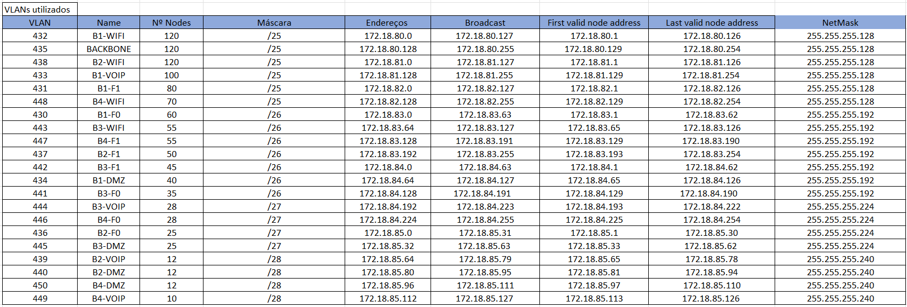

RCOMP 2021-2022 Project - Sprint 2 planning
===========================================
### Sprint master: 1201484 ###
# 1. Sprint's backlog #
T.2.1 - Development of a layer two and layer three Packet Tracer simulation for building one, encompassing the campus backbone. Integration of every member’s Packet Tracer simulation into a single simulation. T.2.2 - Development of a layer two and layer three Packet Tracer simulation for building two, encompassing the campus backbone. T.2.3 - Development of a layer two and layer three Packet Tracer simulation for building three, encompassing the campus backbone.T.2.4 - Development of a layer two and layer three Packet Tracer simulation for building four, encompassing the campus backbone.

# 2. Technical decisions and coordination #

  * O nome dos dispositivos é sempre criado seguindo a forma: builidingNumber_deviceName_floorNumber
  * Todos os membros usaram Cisco Packet Tracer version 8.0.0.0212.
  * O nome de domain do vtp tem que ser rc22dlg4
  * As VLANs devem encontrar-se no intervalo [430-460]
  
- Para a divisão dos addresses organizámos os nodes por ordem descrescente e calculámos a máscara para conjunto de nodes, após isso comecámos no IPV4 atribuído ao nosso grupo e fomos somando os respetivos blocos de rede cumprindo a regra de começar pelo de maior máscara, depois achámos os endereços de broadcast e os primeiros e últimos endereços válidos.  

*Network Addresses*

- Para os endereços de backbone calculámos 5 endereços e distribuímos pelos routers de cada edifício e para o MC.

*Backbone and IPS addresses*

  
# 3. Subtasks assignment #

  * 1201474 - Development of a layer two and layer three Packet Tracer simulation for building one, encompassing the campus backbone. Integration of every member’s Packet Tracer simulation into a single simulation.
  * 1201484 - Development of a layer two and layer three Packet Tracer simulation for building two, encompassing the campus backbone.
  * 1201461 - Development of a layer two and layer three Packet Tracer simulation for building three, encompassing the campus backbone.
  * 1201506 - Development of a layer two and layer three Packet Tracer simulation for building four, encompassing the campus backbone.