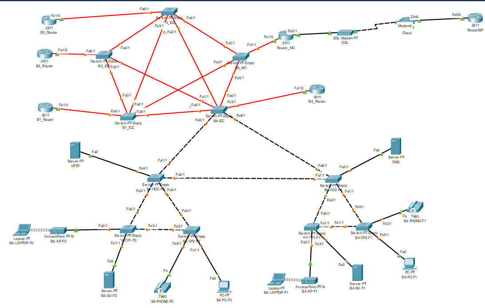

RCOMP 2021-2022 Project - Sprint 3 - Member 1201506 folder
===========================================
(This folder is to be created/edited by the team member 1201506 only)

#### This is just an example for a team member with number 1201506 ####

### Each member should create a folder similar to this, matching his/her number. ###

The owner of this folder (member number 1201506) will commit here all the outcomes (results/artifacts/products)
of his/her work during sprint 3. This may encompass any kind of standard file types.

## Planeamento
Neste Sprint, foram mantidas todas as definições do projeto do ***Packet Tracer*** elaborado no Sprint anterior, de forma a ser utilizado como base do novo projeto.

## Projeto no *Packet Tracer*
Após a definição e distribuição de todas as designações e ids, iniciou-se a simulação no *Packet Tracer*.

Simulação completa elaborada para o edifício 4.

## 1. Rotas dinâmicas OSPF

* Começámos por eliminar as tabelas de rotas em todos os routers, exceto a rota default que liga ao ISP.
* Depois definimos a área do backbone que tem como id 0.
* De seguida fizemos o mesmo passo mudando os ips para os ips das vlans do edifício 3 e a respetiva wildcard com área 3.

Comandos usados:

router ospf 1 network router-backboneAddress wildcard area 0

network router-address network-wildcard area id

...

## 2. HTTP

Com base na interpretação do eunciado adicionámos um server que assegura os serviços HTTP e que está ligado à network
DMZ. Assim:

* Adicionámos um servidor conectado à VLAN DMZ para assegurar o serviço HTTP.
* Criámos uma página HTML identificando o edifício.

## 3. Serviço DHCPv4

Como dito no enunciado o router de cada edifício deve providenciar serviço DHCPv4 para todas as redes locais exceto para
a DMZ e backbone. Desta maneira:

* A configuração do voip foi feita com a opção 150, de acordo com o enunciado.
* Os nomes definidos para as pools foram:
    * B4-F0
    * B4-F1
    * B4-WIFI
    * VOIP-B4
* Depois de configurarmos o DHCP para cada VLAN excluímos o ip da mesma no router usando o comando:
  ip dhcp excluded-address ip_router
* De seguida todos os pcs e laptops passam a receber configuração DHCP.

## 4. Serviço VOIP

Todos os router devem ter a capacidade de providenciar serviço VOIP à rede local de VOIP. Assim:

* Nas portas do switch ligadas aos telefones foi ativado o voice vlan(switchport voice vlan VLANID) e desativado o voice
  vlan(no switchport access vlan).
* De seguida configurámos o serviço de telefonia onde definimos o número máximo de e-phones e o número de cada um.
    * ephone-dn 1
    * number 3000

    * ephone-dn 2
    * number 3001

* Por fim configurámos os routers para que possa ser possível as chamadas entre edifícios diferentes.

## 5. DNS
* O DNS server(ns.building-4.rcomp-21-22-dl-g4) e o DNS domain name(building-4.rcomp-21-22-dl-g4) já tinham sido definidos na configuração do DHCP.
* O responsável pelo edifício 1, criou o nome de domínio(rcomp-21-22-dl-g4) que é o de nível mais alto, é o usado como raiz de domínio do DNS.
* Assim criámos records como pedido no enunciado.
* Aos restantes servidores adicionámos o DNS server manualmente.

## 6. NAT
* Efetuámos os comandos que se encontram no ficheiro de configuração do router do building 4 para as portas especifícadas no enunciado, 80(HTTP), 443(HTTPS) e 53(DNS) para TCP e UDP.

* Após isso colocámos cada VLAN dentro da NAT à exceção do backcone, realizando os comandos:
    * ip nat inside
    * ip nat outside

## 7. ACLs

* Para a confiuração das ACLs começámos por bloquear as falsificações internas excluíndo a DMZ.
* A seguir permitimos todos os pedidos de ICMP e respostas echo.
* Todo o tráfico para a DMZ foi bloqueado exceto o DNS e HTTP/HTTPS. E o tráfico da DMZ foi permitido.
* Qualquer tráfico direcionado para o router com um IPv4 que pertence a ele foi bloqueado.
* Por fim o tráfico que passa elo router foi permitido.

Todas as configurações encontram-se no ficheiro de configurações do router.

